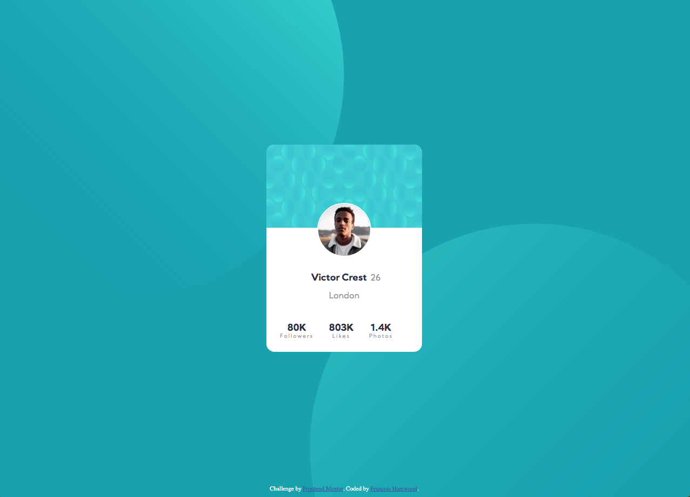

# Frontend Mentor - Profile card component solution

This is a solution to the [Profile card component challenge on Frontend Mentor](https://www.frontendmentor.io/challenges/profile-card-component-cfArpWshJ). Frontend Mentor challenges help you improve your coding skills by building realistic projects. 

## Table of contents

- [Overview](#overview)
  - [The challenge](#the-challenge)
  - [Screenshot](#screenshot)
  - [Links](#links)
- [My process](#my-process)
  - [Built with](#built-with)
  - [What I learned](#what-i-learned)
  - [Continued development](#continued-development)
  - [Useful resources](#useful-resources)
- [Author](#author)


**Note: Delete this note and update the table of contents based on what sections you keep.**

## Overview

### The challenge

- Build out the project to the designs provided

### Screenshot




### Links

- Solution URL: [https://github.com/hexachordal/profile-card-component-main](https://github.com/hexachordal/profile-card-component-main)
- Live Site URL: [https://hexachordal.github.io/profile-card-component-main/](https://hexachordal.github.io/profile-card-component-main/)

## My process

### Built with

- Semantic HTML5 markup
- SASS
- Flexbox
- CSS Grid
- Mobile-first workflow


### What I learned

For this website I saw that it was a profile card and thought that I might try bootstrap but unfortunately decided against it since I don't quite get it yet (hope to try it in future). I learned how to utilize good html layout to make my css/sass job a lot easier to work with. This is my second time using sass and I feel more comfortable with it though I did not use as many mixins (will plan to refactor the sass to add them). The toughest part for me was using the SVG files to get them to work. I tried putting them in the body as two background images but that did not work as well as making them two divs in the body then wrapping the content of the page in another div like so:

```css
* body .bkg-top {
    position: absolute;
    top: 0%;
    left: 0%;
    width: 100%;
    height: 100%;
    z-index: -1;
    background-size: 65vw;
    background-position: -15vw -5vh;
    background-repeat: no-repeat;
    background-image: url("images/bg-pattern-top.svg");
  }
```

There was a lot of awkardness with making the circles responsive and in the end, I was not able to do it as well as I would have liked to. Hopefully I can improve on it for future projects. I did however learn to implement font-weight though I did not see that much of a difference (will investigate further).


### Continued development

In terms of continuing development on this project, I plan to refactor the code in the future with sass mixins as well as solve the SVG issues but since I want to do as many projects as I can, there is a chance I may not come back for a while. I should also begin commenting in my code better for when I do want to come back to edit something.


### Useful resources

- [MDN Web Docs](https://developer.mozilla.org/en-US/docs/Web/CSS) - The OG of web sources. Getting the indepth knowledge helped a lot with especially background-image things.

- [SASS](https://sass-lang.com/guide) - As with any time I use sass, I will refer to this document to remember syntax on how to do things.


## Author

- Website - [Github](https://github.com/hexachordal)
- Frontend Mentor - [@hexachordal](https://www.frontendmentor.io/profile/hexachordal)


